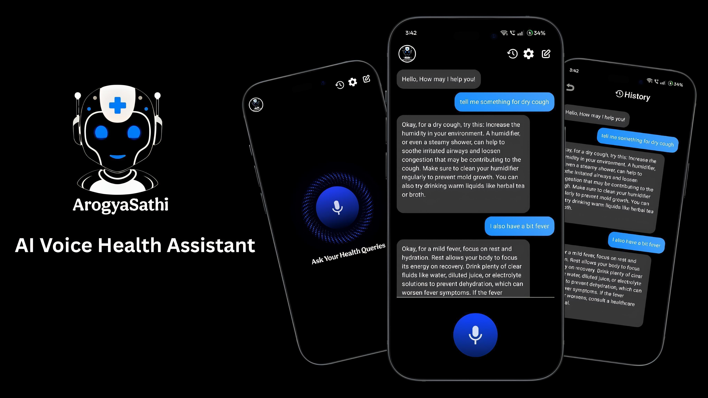
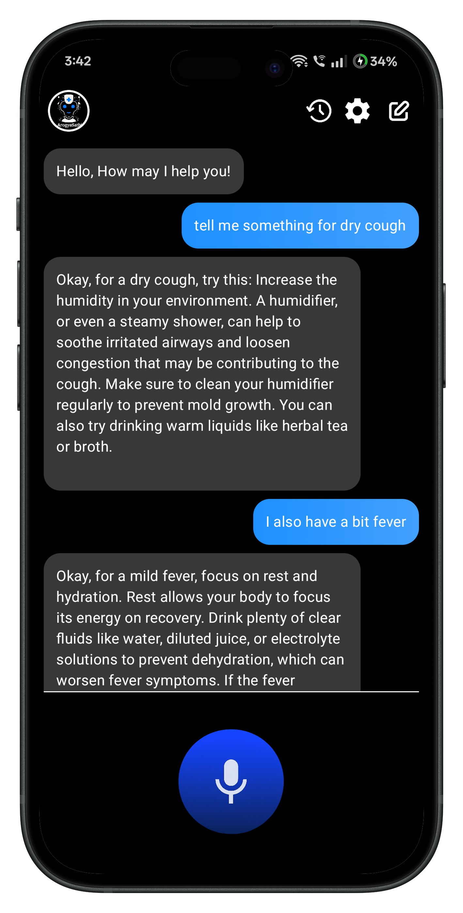
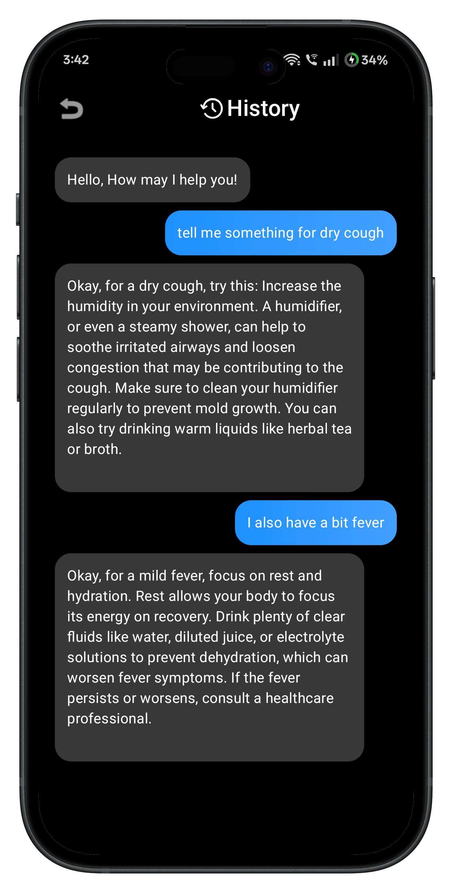
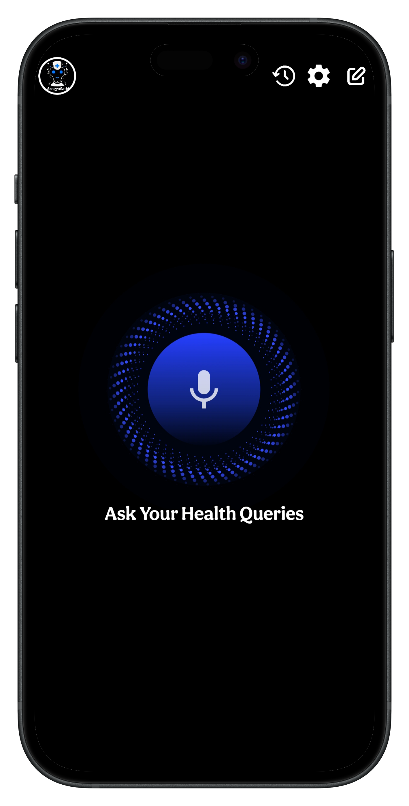

<h1 align="center">🤖 ArogyaSathi – AI Voice Health Assistant</h1>

  
  
  

ArogyaSathi is an AI-powered multilingual voice health assistant that helps users ask health-related queries using voice in multiple languages. Built natively in Kotlin, it leverages **Google's Gemini API** for generating intelligent responses and uses **Firebase Firestore** for storing chat history.

---

---

## 🚀 Features

- 🎤 **Voice Input (Speech-to-Text)** – Users can speak their health questions
- 🧠 **AI Responses with Gemini** – Smart answers generated using Gemini API
- 🗣️ **Text-to-Speech** – App replies back in voice
- 🌐 **Multilingual Support** – Works in **Hindi**, **English**, and **Marathi**
- 💬 **Chat Interface** – User-friendly conversation UI
- 📂 **Chat History** – Stores and retrieves past conversations
- 🔐 **Google Sign-In** – Integrated via Credential Manager API

---

## 📸 Screenshots
<table>
  <tr>
    <td></td>
    <td></td>
  </tr>
  <tr>
    <td></td>
    <td></td>
  </tr>
</table>
---

## 🛠️ Tech Stack

- **Language**: Kotlin
- **Architecture**: MVVM
- **UI**: XML
- **Voice Input**: Android SpeechRecognizer
- **Voice Output**: Android Text-To-Speech
- **AI Backend**: Gemini API (Google)
- **Authentication**: Google Sign-In via Credential Manager API
- **Database**: Firebase Firestore
- **Multilingual Support**: Locale & Language config

## Download 
- Download latest version from releases
